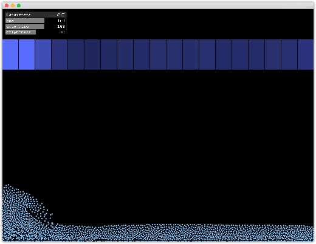

# water-led
Openframeworks setup to translate a simple liquid simulation into LED strip brightness. Uses [LiquidFun](https://github.com/tado/ofxLiquidFun) and [ofxOPC](https://github.com/DHaylock/ofxOPC) to control a [FadeCandy](https://github.com/scanlime/fadecandy) connected LED strip.

The water simulation can be influenced by pressing `j` or `k` to push the water to the left or the right.

